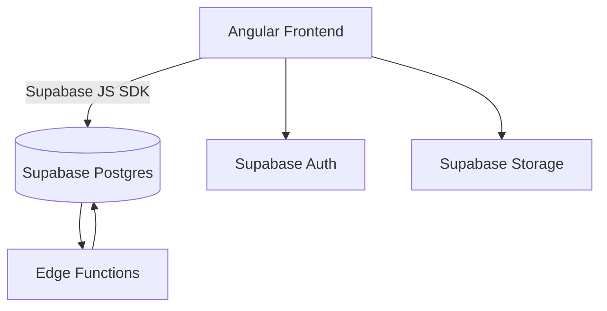

# FinBoard Architecture Overview

## Stack
- **Frontend:** Angular (Vercel)
- **Backend:** Supabase (Postgres + Auth + Storage + Edge Functions)
- **Communication:** Direct SDK calls via Supabase JS
- **Charts:** Recharts / Chart.js
- **Deployment:** GitHub + Vercel
- **Auth:** Email + OAuth (Google, GitHub)

## Architecture Diagram (Mermaid)

## Data Flow
1. Angular fetches/saves data via Supabase JS SDK.  
2. Supabase RLS enforces user-level isolation.  
3. Direct SDK = minimal latency, fewer backend layers.  
4. Edge Functions for heavy analytics (later).  

## Scalability
- RLS-ready schema for multiple users  
- Indexes on `user_id` and `category_id`  
- Vercel edge caching for static assets  
- Supabase auto-scaling Postgres
